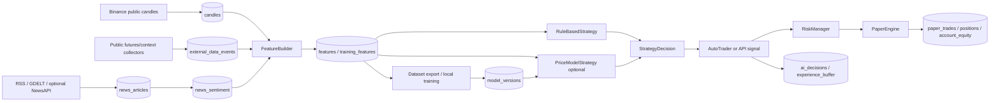

# Anata V2 implementation audit

Audit date: 2026-07-23  
Scope: current `EpicNIthan/-Anata_AI-Trader` checkout before the V2 migration.  
Classification vocabulary: **BLOCKER**, **CRITICAL**, **HIGH**, **MEDIUM**, **LOW**.

> This file preserves the pre-implementation audit. The 2026-08-04 implementation
> and real-data validation outcome is recorded in
> [ANATA_V2_ACCEPTANCE.md](ANATA_V2_ACCEPTANCE.md); findings below describe the state
> observed at audit time, not unresolved claims about the current checkout.

## Executive summary

The repository is an operational paper-only FastAPI application with useful public-data
collectors, a capable feature builder, an uploaded-model mechanism, a working paper
ledger, a Jinja dashboard, and a deliberately lightweight deployment shape. It is not
yet a separated quantitative system: the active path mixes prediction, sizing,
leverage, stops, and execution intent in `StrategyDecision`.

The most urgent legacy defect is **CRITICAL**: an uploaded model's `margin_pct` or `leverage`
causes `RiskManager.evaluate()` to return from `_evaluate_ai_plan()` before normal
confidence, daily-loss, cooldown, open-position, normal margin, and fee controls. The
same direct path skips some auto-trader duplicate/position-management controls. V2
must make model output informational only and require a persisted risk approval before
paper execution.

The implementation therefore preserves current collectors, features, data exports,
paper trades, model records, API authentication, templates, and Railway deployment,
while adding a traceable, paper-only V2 path alongside backwards-compatible legacy
endpoints.

The checkout also contained an uncommitted partial V2 implementation at audit time.
That implementation is useful and is being preserved, but it has **BLOCKER** integration
defects: `FeatureBuilder` calls an undefined `_recent_external_ai_features()` method;
the `/api/v2` router is not mounted; registered champions do not affect the V2 model
set; sandbox accounts run the ordinary baseline with ordinary limits; and target
notional is multiplied by leverage a second time during execution. These are runtime
defects, not documentation gaps, and must be fixed before the V2 path is considered
operational.

## Current system diagram

## Existing database entities

| Area | Current entities | Assessment |
| --- | --- | --- |
| Market | `candles`, `live_candle_updates`, `market_ticks` | Preserve. Candles have useful identity/indexes but not complete point-in-time availability fields. |
| News | `news_articles`, `news_sentiment` | Preserve. Supports source/raw text/sentiment but lacks received/processed availability and typed event enrichment. |
| Features/training | `features`, `training_features`, `experience_buffer` | Preserve. Feature payloads/versioning exist; no formal feature registry or validation ledger. |
| Paper ledger | `paper_trades`, `positions`, `account_equity` | Preserve and bridge. It has fees/PnL but no account partition, order/fill state machine, slippage/funding attribution, or V2 trace IDs. |
| Models | `model_versions`, `training_runs` | Extend. Existing active/candidate status and package metadata are useful but do not express lifecycle, health, champion/challenger, checksum, or compatibility. |
| Decision log | `ai_decisions` | Preserve as a legacy audit record. It conflates decision and execution; V2 will write explicit stage records. |
| External context | `external_data_events` | Preserve for derivatives, spot, liquidation, fear/greed, macro and market context. |

## Existing data flow

1. `collectors/market_collector.py` writes public Binance candle data; spot,
   derivative, liquidation and external collectors write `external_data_events`.
2. News collectors write `news_articles`; `app.ai.news_sentiment` supplies
   deterministic sentiment with optional Hugging Face inference.
3. `FeatureBuilder` combines candles, technical indicators, news, derivative and
   external context into a versioned `Feature` payload and a training feature record.
4. `data_bundles`, raw export services, lifecycle services, label builders and scripts
   export/compact data for laptop training.

**Preserve:** public-only collection, existing numeric feature calculations, raw
archives, daily bundles, artifact upload, and local-first heavy training.

## Existing training and inference flow

Training is intentionally mostly local. `training/export_dataset.py`, label builders,
dataset acceleration, `scripts/prepare_training_data.py`, and local model scripts
produce artifacts. `ModelVersion` records path/schema/metrics/status. Server training
is disabled by default.

At runtime, `PriceModelStrategy` chooses the latest `ModelVersion.status == "active"`,
loads linear JSON or joblib artifacts, predicts a return, and then creates a
`StrategyDecision`. Existing artifacts can include separately trained targets for
margin, leverage, stop, take-profit, and holding period.

**HIGH – training-serving skew:** package validation is partial. Feature columns are
checked opportunistically, but there is no mandatory manifest/checksum/preprocessing
contract, no required/optional feature distinction, and legacy model packages may
contain sizing targets that should never govern execution.

## Existing paper execution flow

`AutoTraderService` creates a `Feature`, chooses rule-based or uploaded-model strategy,
optionally explores, then calls `PaperEngine.execute_signal()`. The engine resolves a
mark price, invokes `RiskManager`, mutates `Position`, writes `PaperTrade`, and records
account equity. It supports long/short paper positions, fees, simple stops/takes, and
realized/unrealized PnL.

**CRITICAL – AI-plan risk bypass:** when leverage or margin is supplied,
`RiskManager.evaluate()` returns early through `_evaluate_ai_plan()` before confidence,
daily-loss, cooldown, maximum-open-position, normal max-margin, and fee-exposure
controls. The AI-plan helper only performs limited validation and a 100% equity cap.

**HIGH – universal controls are incomplete:** data-collection exploration deliberately
bypasses several gates; model execution bypasses auto-trader duplicate and position
management filters; there is no kill switch or execution-time stale-market-data gate.

**HIGH – sandbox contamination risk:** paper ledger tables have no `paper_account_id`,
so sandbox activity would currently share equity, positions, daily loss and position
limits with the champion account.

**MEDIUM – execution simulation limitations:** execution fills immediately at a mark,
uses a flat fee, and stores neither explicit order state, latency, spread, slippage,
partial fill, funding nor reconciliation records.

## Existing dashboard/API flow

`app.main` mounts static assets and includes a protected `/dashboard` Jinja route plus
the protected `/api` router. The administrative page uses lightweight JavaScript and
Lightweight Charts. Existing sources for an honest legacy fallback are candles,
features, AI decisions, paper trades/positions/equity, news, and external events.

**MEDIUM – dashboard evidence gap:** there is no stored model/signal/ensemble/risk
trace, so the current dashboard cannot truthfully show how a decision was composed.
The V2 Vision page must return recorded values or explicit null/empty states; it must
not invent uncertainty, attribution, or explanations.

## Findings by severity

### BLOCKER

- `FeatureBuilder.build_for_symbol()` calls `_recent_external_ai_features()`, but the
  method is absent. Every live V2 feature/pipeline run therefore fails before a model
  prediction is produced.
- `app/api/v2.py` defines lifecycle, sandbox, shadow, promotion, rollback and kill-switch
  operations, but `app/main.py` does not include its router; all of those operations are
  unreachable in a deployed application.
- The portfolio layer defines exposure as signed notional/equity, but the execution
  adapter calculates notional as `delta * equity * leverage`. This applies leverage
  twice and can turn a capped 10% exposure into 30% notional at 3x.
- `V2PipelineService` always instantiates deterministic baseline models. Champion
  assignments, shadow lifecycle records and a sandbox candidate's registered artifact
  do not affect inference, so the implemented registry is not connected to production.
- A sandbox account ignores its registered starting balance and exposure cap when run
  through the pipeline. Account ledger rows are separated, but candidate behavior and
  risk budgets are not yet isolated correctly.

There is still no live exchange order code, private exchange API, withdrawal path, or
real-money credential requirement.

### CRITICAL

- Uploaded model plans bypass core global risk checks as described above.
- Prediction, portfolio sizing, leverage and execution intent are coupled in
  `StrategyDecision` and `PriceModelStrategy`.

### HIGH

- No persisted risk approval/decision lineage is required before paper execution.
- No kill switch; no execution-time stale data rejection.
- Exploration/model paths can bypass controls that ordinary rule signals receive.
- Sandboxes cannot be isolated with the current accountless ledger.
- New/existing model packages lack a strict feature/preprocessing/checksum manifest.
- Current `requirements.txt` includes heavy training/HF packages despite the intended
  Railway-light deployment model.
- Point-in-time availability is not explicit for news/features; historic feature use
  can accidentally rely on data received after a decision time.

### MEDIUM

- Additive migration helper can add columns but does not version/transactionally
  describe schema changes; migration must remain additive and idempotent.
- No formal model/signal lifecycle, health, promotion, challenger or rollback record.
- Testing is dominated by one broad smoke test; unit/integration regression coverage
  for architecture boundaries is absent.
- Historic simulation uses simple fills and does not provide realistic cost/funding,
  partial fill, volume participation or restart-reconciliation records.
- Raw-data lifecycle cleanup does not account for new V2 foreign-key references from
  predictions to features or structured events to news. Deleting otherwise-retainable
  legacy rows can fail until V2 dependents are archived or protected.
- Railway web process currently starts several workers in one lifecycle; heavy research
  must remain local and never block a request.

### LOW

- Existing dashboard terminology treats an uploaded model as the central strategy;
  it needs terminology and visibility updates for narrow-model evidence.
- Some README commands reference scripts that are not present in this checkout and
  should be corrected or replaced with supported V2 commands.
- AI Vision hard-codes its refresh interval, returns the oldest bounded candle slice for
  some ranged queries, and can show a symbol-unrelated external-AI request because the
  request ledger has no symbol key.

## Data-leakage and point-in-time risks

- `NewsArticle.published_at` and record creation are available, but received,
  processed, and available-to-model times are not first-class fields.
- Feature building queries the latest records and uses freshness metadata, but the
  historical/research path does not yet enforce `available_to_model_time <= decision`.
- External data can be revised or delayed; raw payload and availability must be
  retained rather than treated as a timeless value.
- Time-series train/validation/test splitting, purge and embargo are not a single
  shared framework. Randomized or unguarded downstream experimentation would leak.

## Railway resource constraints

Keep web/collector/paper-trader/enrichment logic lightweight: FastAPI, SQLAlchemy,
joblib/scikit-learn-compatible inference, public HTTP collection and basic local-news
rules. Do not install or import `torch`, `transformers`, LightGBM or XGBoost in default
Railway requirements. Heavy teacher/news preparation, configuration search, model
fitting, walk-forward tests and artifact packaging belong on the local computer.

## Target Anata V2 architecture

```mermaid
flowchart LR
    D[Public data + raw archives] --> Q[Point-in-time data quality]
    Q --> F[Feature platform]
    F --> NM[Approved narrow models]
    NM --> MP[(model_predictions)]
    MP --> TS[(trading_signals)]
    TS --> EN[Regime-aware deterministic ensemble]
    EN --> ED[(ensemble_decisions)]
    ED --> PO[Portfolio construction]
    PO --> PT[(portfolio_targets)]
    PT --> RI[Independent risk policy]
    RI --> RD[(risk_decisions)]
    RD --> EX[Paper execution simulator]
    EX --> SO[(orders / fills / legacy paper ledger)]
    SO --> MO[Outcomes, health, attribution]

    F --> RE[Local research / walk-forward / strategy specs]
    RE --> RG[Registry, shadow, sandbox]
    RG --> NM
    PR[Explicit human promotion] --> RG
```

The production side executes only frozen registered champions or narrow rule baselines.
Research creates candidates/challengers, runs shadow/sandbox evaluation and records
results. Automatic champion promotion is disabled by default.

## File-by-file migration map

| Current location | V2 action |
| --- | --- |
| `app/config.py` | Extend with validated safe V2, risk, execution, registry, external-AI, Vision and research settings. |
| `app/db/models.py` | Preserve existing entities; add V2 stage, registry, research, health, news enrichment and sandbox entities; add account/trace fields additively. |
| `app/db/migrations.py` | Extend only with idempotent additive columns; new tables use metadata creation. Never drop user data. |
| `app/features/feature_builder.py` | Preserve calculations; attach availability/data-quality/external-context metadata and validate before model use. |
| `app/ai/strategy.py` | Retain as legacy comparison baseline; migrate useful rules into narrow signal producers. |
| `app/ai/model_strategy.py` | Retain legacy artifact compatibility but remove its authority to create sizing/execution plans; adapt to standardized predictions. |
| `app/trading/risk_manager.py` | Refactor universal exposure-increase checks; add stale/kill/portfolio controls and persisted V2 decisions. |
| `app/trading/paper_engine.py` | Preserve ledger/account calculations; add an approved-risk-only V2 adapter and order/fill trace bridge. |
| `app/services/auto_trader.py` | Change main loop to V2 orchestration with a legacy fallback signal producer; retain public controls/status aliases. |
| `app/training/*`, `scripts/*` | Preserve existing export/train tools; add point-in-time splitting, candidate evaluation, registry and teacher/student commands locally. |
| `app/api/routes.py` | Preserve legacy endpoints; add bounded V2 registry/research/Vision APIs. |
| `app/dashboard/*` | Preserve administrative dashboard; add a separate protected `/vision` Jinja page and assets. |
| `requirements*.txt` | Make default Railway dependencies lean; move optional heavyweight dependencies to local files. |
| `README.md`, `RAILWAY_DEPLOY.md`, `docs/*` | Document run modes, migrations, promotion/rollback, local research, external AI and limits. |
| `tests/` | Add unit/integration/regression/end-to-end V2 tests while retaining the broad smoke test. |

## Migration decisions

- All V2 additions are additive. Existing models, paper trades, positions, decisions,
  datasets and API routes remain readable.
- Legacy models are represented as compatible registry records and may generate a
  prediction, but their learned sizing targets are ignored by V2.
- The emergency risk policy is fail-closed for exposure increases; it allows protective
  reduction/close operations.
- External AI is optional context only. Failure, quota exhaustion or invalid JSON must
  leave local intelligence/paper operation available.
- No component in this migration may add real exchange execution.
