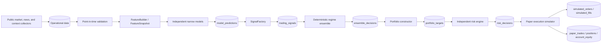

# Anata V2 architecture

Anata is a **paper-only** quantitative research platform. It has no private exchange
credentials, live order adapter, withdrawal capability, or real-money execution path.
The core rule is:

> Learn continuously. Test continuously. Trade only frozen registered versions.

## Runtime path



`V2PipelineService` in `app/pipeline/service.py` owns this order. A prediction is
strictly a forecast: it cannot carry a margin, leverage, notional, action, or order
instruction. Only `PaperExecutionSimulator` imports the legacy `PaperEngine`, and it
requires a persisted, approved `RiskDecisionRecord` for the same paper account.

## Production/paper versus local research

| Location | Runs there | Must not run there |
| --- | --- | --- |
| Railway / deployed app | FastAPI, public collectors, features, deterministic baseline inference, risk, paper ledger, Vision, data export | Heavy model fitting, HF/torch workloads, configuration search, automatic champion promotion |
| Local computer | Permanent data lake, raw-news preparation, teacher/student jobs, training, historical and walk-forward evaluation, research scheduler | Direct production promotion without an explicit operator action |

The deployed process starts enabled collectors and the paper auto-trader in its FastAPI
lifespan. Heavy research is invoked with local scripts; it is not a request handler or
a default Railway worker.

## Module boundaries

| Layer | Main implementation | May do | Must not do |
| --- | --- | --- | --- |
| Data and features | `app/collectors/`, `app/features/` | Persist public data and compute versioned features | Infer a future value as already known |
| Models | `app/pipeline/narrow_models.py` | Emit `ModelPrediction` distributions | Import `PaperEngine`, choose leverage, place an order |
| Signals/ensemble | `signals.py`, `ensemble.py` | Turn forecasts into tradable evidence and combine it | Bypass portfolio/risk or call execution |
| Portfolio/risk | `portfolio.py`, `risk.py` | Request and independently approve bounded exposures | Trust model sizing hints |
| Execution | `execution.py`, `app/trading/paper_engine.py` | Simulate a paper fill after persisted risk approval | Call a live exchange |
| Intelligence | `app/intelligence/` | Produce validated local/external news context | Create orders or alter risk limits |
| Research | `app/research/`, `scripts/` | Test declarative candidates locally | Silently replace the champion |

## Baseline model set

The production baseline currently emits eight independent forecasts:

- short- and medium-horizon momentum;
- mean reversion and breakout pressure;
- derivatives flow and liquidation pressure;
- news event and broad market context.

It also uses a cost estimate and a reliability estimate. These are deterministic,
lightweight starting points, not claims of profitability. Stronger artifacts can replace
one family at a time through the registry contract.

## Traceability and compatibility

Every V2 run creates a `decision_trace_id` and persists the stages it actually reached:
feature snapshot, predictions, signals, ensemble decision, portfolio target, risk
decision, order/fill, and timeline events. The V2 tables coexist with legacy
`ai_decisions`, `paper_trades`, `positions`, and `account_equity`; Vision labels a
legacy replay as partial rather than fabricating missing stages.

Run the app locally:

```powershell
python -m pip install -r requirements.txt
uvicorn app.main:app --host 0.0.0.0 --port 8000
Invoke-RestMethod http://localhost:8000/health
```

See [OPERATIONS_RUNBOOK.md](OPERATIONS_RUNBOOK.md) for environment and run-mode
commands, and [MIGRATION_GUIDE.md](MIGRATION_GUIDE.md) for the additive schema path.
