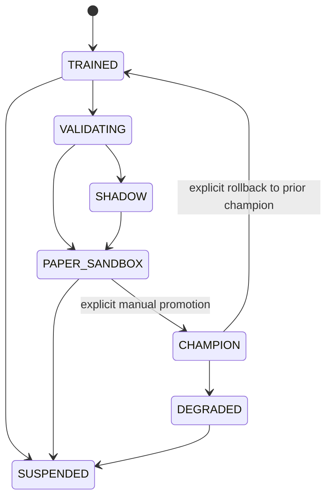

# Champion, challenger, shadow, and sandbox

The registry separates technical compatibility from allocation and promotion. It does
not infer performance quality from a few recent paper trades, and automatic champion
promotion is disabled by default.



## Definitions

| Role | Receives live features | May affect champion exposure | Required before entry |
| --- | --- | --- | --- |
| Champion | Yes | Yes, through V2 portfolio/risk/execution | Explicit assignment and a compatible artifact |
| Challenger | Not necessarily | No | Registered candidate metadata |
| Shadow | Yes | No | Finite, compatible prediction evidence |
| Paper sandbox | Separate fake account | No | Technical compatibility and exposure cap |

`ModelRegistry.record_shadow()` writes a `shadow_predictions` row only. Shadow output
does not flow into `TradingSignal` allocation or a portfolio target.

`start_sandbox()` creates a unique `paper_sandbox_accounts.account_id`, tags the model
as `PAPER_SANDBOX`, and applies `V2_SANDBOX_MAX_EXPOSURE_PCT`. Sandbox admission does
not require a Sharpe, win-rate, profit-factor, superiority, or minimum trade count.
It does require a loadable artifact and feature contract; every sandbox execution still
uses the normal paper-only risk controls.

## Manual promotion and rollback

Promotion is an explicit, auditable database operation. It closes the current scoped
`champion_assignments` row, opens the new one, changes lifecycle/status, and writes a
`promotion_decisions` record. Rollback restores the previous recorded champion and
writes another promotion-decision record.

```powershell
@'
from app.db.session import SessionLocal
from app.pipeline.registry import ModelRegistry

with SessionLocal() as session:
    registry = ModelRegistry(session)
    champion = registry.promote(
        model_version_id=123,
        model_family="alpha.short_horizon_momentum",
        symbol_scope="BTCUSDT",
        actor="manual",
        reason="Reviewed walk-forward and shadow evidence",
    )
    session.commit()
    print(champion.id, champion.lifecycle_state)
'@ | python -
```

```powershell
@'
from app.db.session import SessionLocal
from app.pipeline.registry import ModelRegistry

with SessionLocal() as session:
    restored = ModelRegistry(session).rollback(
        model_family="alpha.short_horizon_momentum",
        symbol_scope="BTCUSDT",
        actor="manual",
        reason="Operator rollback",
    )
    session.commit()
    print(restored.id, restored.lifecycle_state)
'@ | python -
```

Review recorded registry state in Vision:

```powershell
Invoke-RestMethod "http://localhost:8000/api/vision/research?symbol=BTCUSDT" `
  -Headers @{"x-admin-token"="YOUR_ADMIN_TOKEN"}
```

## Current integration boundary

The registry and audit tables are operational. The default V2 paper loop currently runs
the deterministic narrow-model baseline; a registered artifact must be explicitly
wired into its family provider before it replaces that baseline. A champion assignment
alone is therefore not evidence that an arbitrary uploaded legacy model is executing.
This conservative boundary avoids silently restoring the old model-to-order path.
