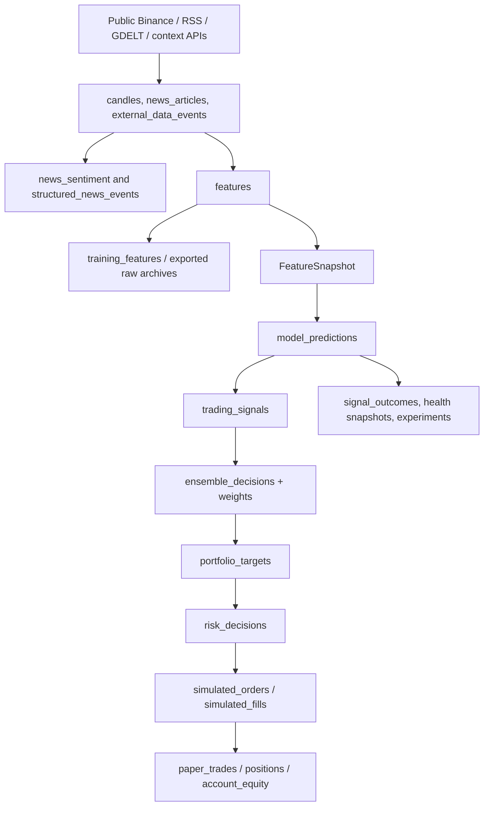

# Data lineage

All operational timestamps are UTC. The platform retains source rows and stage-level
decision records so a paper outcome can be traced without reconstructing a narrative.



## Source-to-record mapping

| Source | Operational record | Key time used | Notes |
| --- | --- | --- | --- |
| Closed Binance candles | `candles` | `open_time` / `close_time` | V2 validates OHLC, duplicates, future stamps, and gaps. |
| Live candle updates | `live_candle_updates` | `event_time` | Chart context only; closed candles are preferred for training. |
| RSS/GDELT/news providers | `news_articles`, `news_sentiment` | `available_to_model_time` | Published time is not automatically availability time. |
| Public futures/spot/macro context | `external_data_events` | `event_time` | Feature builder applies freshness metadata. |
| Feature calculation | `features`, `training_features` | `as_of`, `available_to_model_time` | Schema version and payload preserve the vector. |
| V2 decision stages | V2 ledger tables | stage-specific UTC time | Joined by `decision_trace_id`; the IDs also link predecessor stages. |

## Decision trace keys

Use these values when inspecting one decision:

| Record | Primary trace fields |
| --- | --- |
| prediction | `prediction_id`, `decision_trace_id`, `feature_snapshot_id` |
| signal | `signal_id`, `prediction_id`, `decision_trace_id` |
| ensemble | `ensemble_decision_id`, `decision_trace_id` |
| target | `portfolio_target_id`, `source_ensemble_decision_id`, `decision_trace_id` |
| risk | `risk_decision_id`, `portfolio_target_id`, `decision_trace_id` |
| order/fill | `order_id`, `risk_decision_id`, `decision_trace_id`, `paper_account_id` |

The protected replay endpoint is the quickest inspection path:

```powershell
$Token = "YOUR_ADMIN_TOKEN"
Invoke-RestMethod "http://localhost:8000/api/vision/decisions?symbol=BTCUSDT" `
  -Headers @{"x-admin-token"=$Token}
Invoke-RestMethod "http://localhost:8000/api/vision/replay/TRACE_ID" `
  -Headers @{"x-admin-token"=$Token}
```

## Archive and synchronization flow

Railway is a temporary data factory. Download and checksum its raw archive before any
cleanup, then keep the verified ZIPs in the local data lake. `download_raw_data.py`
verifies its manifest and can split/merge UTC daily archives.

```powershell
$Url = "https://YOUR-APP.up.railway.app"
$Token = "YOUR_ADMIN_TOKEN"
python scripts/download_raw_data.py --url $Url --token $Token `
  --finished-only --daily-files --training-only --output-dir local_data/raw
```

For a local database archive instead of a deployed download:

```powershell
python scripts/export_local_raw_days.py --output-dir local_data/raw --since-date 2026-07-01 --until-date 2026-07-07
```

Do not delete source data merely because a feature, prediction, or model exists. Raw
data is the evidence needed to reproduce a research experiment and investigate drift.
