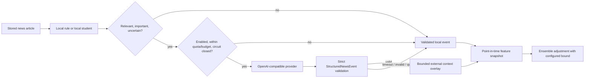

# Optional external AI intelligence

External AI is an optional, bounded news-context overlay. It is not a strategy,
cannot change risk limits, and has no import path to portfolio or paper execution.
The paper loop must remain usable when every external provider is disabled or fails.



## Implemented levels

- Level 0: `LocalRuleProvider`, deterministic and always available.
- Level 1: `LocalStudentProvider`, which loads the compact JSON Naive-Bayes
  artifact produced by `scripts/train_news_student.py`; runtime resolves the manually
  active durable database package first, an environment artifact second, and rules
  on failure.
- Level 2: `GenericOpenAICompatibleProvider`, an optional structured-JSON HTTP
  adapter shared by the configured Gemini, Groq, Hugging Face router, and generic
  endpoint entries. `build_intelligence_router()` is the runtime factory.
- Level 3: offline teacher preparation on the local computer. It writes labels only;
  it is not part of Railway inference.

Every external entry uses the same SDK-free OpenAI-compatible `/chat/completions`
contract. Gemini, Groq, and Hugging Face entries are instantiated only when their key
and model are set; a provider-order name alone does not make a request possible. The
generic entry additionally requires `GENERIC_AI_BASE_URL`.

## Request gate and failure behavior

The router first creates local structured context. External work is skipped for
duplicate or irrelevant content, low local importance, or sufficiently confident
non-critical local output. Eligible requests then pass all of these controls:

- explicit `EXTERNAL_AI_ENABLED=true`;
- a configured provider in the ordered list;
- daily request allowance;
- declared input/output pricing and monthly budget allowance;
- TTL cache lookup;
- restart-safe content-hash and prompt-version cache hydration from PostgreSQL;
- a positive per-provider minimum request interval;
- per-provider retry and timeout policy;
- per-provider circuit breaker;
- strict enum, range, timestamp, factual-claim, and JSON-object validation.

Unknown generic-provider pricing is treated as unbounded cost and fails the budget
gate. A zero monthly budget permits only a declared zero-cost request. Provider
exceptions are converted to audit statuses and a local result; they do not escape
into the paper loop.

`external_ai_requests` records provider/model names, prompt version, content hash,
timestamps, status, token counts, estimated cost, retry count, cache status, and a
non-secret error category. Each real HTTP attempt, including every retry, gets its own
row. On process start/batch entry, the router hydrates the current UTC-day quota,
UTC-month spend, provider request times, and circuit state from these rows.
`structured_news_events` records the selected validated event and point-in-time
availability. A successful event can be reused by content hash plus prompt version
across another URL or process restart until the configured TTL expires. Keys and raw
provider errors are never stored in either table.

## Safe configuration

The recommended deployment default is local-only:

```env
EXTERNAL_AI_ENABLED=false
EXTERNAL_AI_PROVIDER_ORDER=generic
EXTERNAL_AI_MONTHLY_BUDGET_USD=0
GENERIC_AI_BASE_URL=
GENERIC_AI_API_KEY=
LOCAL_NEWS_STUDENT_PATH=
```

To enable an endpoint intentionally, set all price and spend controls explicitly:

```env
EXTERNAL_AI_ENABLED=true
EXTERNAL_AI_PROVIDER_ORDER=generic
GENERIC_AI_BASE_URL=https://provider.example/v1
GENERIC_AI_API_KEY=secret-from-the-deployment-platform
EXTERNAL_AI_GENERIC_MODEL=provider-model-name
EXTERNAL_AI_INPUT_COST_PER_MILLION_USD=0
EXTERNAL_AI_OUTPUT_COST_PER_MILLION_USD=0
EXTERNAL_AI_MONTHLY_BUDGET_USD=0
EXTERNAL_AI_DAILY_REQUEST_LIMIT=20
EXTERNAL_AI_TIMEOUT_SECONDS=15
EXTERNAL_AI_MAX_RETRIES=2
EXTERNAL_AI_PROVIDER_MIN_INTERVAL_SECONDS=1
```

The zero prices above are appropriate only for an endpoint whose use is genuinely
free. Enter real declared prices and a nonzero budget for a paid service. Never put a
real key in `.env.example`, a model package, logs, or research reports.

Provider-specific entries use these variable groups:

| Provider order name | Required key/model | Optional endpoint/pricing |
| --- | --- | --- |
| `gemini` | `GEMINI_API_KEY`, `GEMINI_MODEL` | `GEMINI_BASE_URL`, `GEMINI_INPUT_COST_PER_MILLION_USD`, `GEMINI_OUTPUT_COST_PER_MILLION_USD` |
| `groq` | `GROQ_API_KEY`, `GROQ_MODEL` | `GROQ_BASE_URL`, `GROQ_INPUT_COST_PER_MILLION_USD`, `GROQ_OUTPUT_COST_PER_MILLION_USD` |
| `huggingface` | `HUGGINGFACE_INFERENCE_TOKEN`, `HUGGINGFACE_INFERENCE_MODEL` | `HUGGINGFACE_INFERENCE_BASE_URL`, `HUGGINGFACE_INPUT_COST_PER_MILLION_USD`, `HUGGINGFACE_OUTPUT_COST_PER_MILLION_USD` |
| `generic` | `GENERIC_AI_BASE_URL`, `EXTERNAL_AI_GENERIC_MODEL` | `GENERIC_AI_API_KEY`, `EXTERNAL_AI_INPUT_COST_PER_MILLION_USD`, `EXTERNAL_AI_OUTPUT_COST_PER_MILLION_USD` |

All four routes expect an OpenAI-compatible chat-completions response. A provider's
native non-compatible endpoint will fail schema/response handling and fall back
locally.

## Influence on the V2 ensemble

`FeatureBuilder` reads only events whose `available_to_model_time` is known by the
decision time. Its base news features come from the persisted `payload.local_event`;
the selected external event is retained as a separate overlay. The V2 pipeline uses
an external event only when
`external_ai_available` is true and converts direction × confidence to a small numeric
adjustment. `V2_EXTERNAL_CONTEXT_MAX_ADJUSTMENT` is an absolute safety bound. Missing,
stale, or failed external context contributes zero; it is not silently interpreted as
neutral evidence.

External context cannot contain leverage, notional, margin, or an executable order.
It cannot register or promote a model. No generated Python is executed.

## Verification

Run deterministic provider/fallback tests without paid credentials:

```powershell
python -m pytest tests/test_intelligence.py -q
```

After authenticated enrichment has run, inspect the recorded status in AI Vision:

```powershell
Invoke-RestMethod "http://localhost:8000/api/vision/state?symbol=BTCUSDT" `
  -Headers @{"x-admin-token"="YOUR_ADMIN_TOKEN"}
```

See [NEWS_TEACHER_STUDENT.md](NEWS_TEACHER_STUDENT.md) for local student training and
[AI_VISION_DASHBOARD.md](AI_VISION_DASHBOARD.md) for request-audit visibility.
