# News teacher/student workflow

News intelligence is trained locally and consumed as context only. A teacher label or
student prediction cannot place a paper order, choose leverage, or promote a trading
model. The compact student imitates structured labels; its evaluation metrics are not
evidence of trading profitability.

```mermaid
flowchart LR
    R[Railway raw news] --> D[Verified laptop archive]
    D --> T[Teacher labels]
    T --> V[Schema and source validation]
    V --> S[Deduplicated student dataset]
    S --> M[Compact JSON student]
    M --> E[Held-out imitation evaluation]
    E --> P[Checksummed package]
    P --> U[Upload as inactive TRAINED candidate]
    U --> A[Explicit manual context activation]
    A --> B[Durable database artifact]
    B --> I[Local inference on every Railway role]
    I --> F[Structured context features only]
```



## 1. Synchronize raw news

Use the repository's raw-data downloader; there is no separate
`download_raw_news.py` command in this checkout.

```powershell
$Url = "https://YOUR-APP.up.railway.app"
$Token = "YOUR_ADMIN_TOKEN"
python scripts/download_raw_data.py --url $Url --token $Token `
  --news-only --finished-only --daily-files --output-dir local_data/raw_news
```

The downloader verifies the archive manifest before optional cleanup. Keep the local
daily ZIPs as the permanent source archive. Do not train on news using its later
processing time as though it were publication time; the V2 preparation rules use the
recorded received/available timestamps.

## 2. Prepare heavy historical news features

The normal point-in-time dataset builder can score historical text with local
FinBERT/CryptoBERT models. This is a laptop workload:

```powershell
python -m pip install -r requirements.txt
python -m pip install -r requirements-local-training.txt
python -m pip install -r requirements-hf.txt
python scripts/prepare_training_data.py --input local_data/raw_news `
  --output-dir local_data/processed --news-converter smart
```

`smart`, `finbert`, and `cryptobert` require local `transformers` and `torch`.
`--news-converter rule-based` is the lightweight fallback, not an equivalent heavy
model. These commands create numeric research data; they do not deploy a model.

## 3. Create and validate teacher labels

Rule mode is the deterministic, dependency-light default. It establishes the exact
schema and is useful for smoke tests and a reproducible baseline dataset:

```powershell
python scripts/run_teacher_extraction.py --input local_data/raw_news `
  --output local_data/teacher_labels.jsonl `
  --rejects local_data/teacher_rejects.jsonl
```

For a laptop-only heavy sentiment teacher, install `requirements-hf.txt`, pin both
the model and its reviewed revision, and select Hugging Face mode explicitly:

```powershell
python scripts/run_teacher_extraction.py --input local_data/raw_news `
  --output local_data/teacher_labels_hf.jsonl `
  --rejects local_data/teacher_rejects_hf.jsonl `
  --teacher-mode hf `
  --teacher-model ProsusAI/finbert `
  --teacher-revision REVIEWED_COMMIT_OR_TAG `
  --local-files-only

python scripts/validate_teacher_labels.py --input local_data/teacher_labels_hf.jsonl `
  --output local_data/teacher_validated.jsonl `
  --rejects local_data/teacher_invalid.jsonl `
  --reject-unverified-numbers
```

Omit `--local-files-only` only when an intentional model download is acceptable. HF
mode merges the heavy sentiment classification with deterministic structural fields;
it remains an offline labeling tool and is never imported by Railway runtime.

The input may be one plain JSONL/JSONL.GZ file, one verified daily ZIP, or the
download directory. Daily ZIP processing reads only `news_articles.jsonl.gz`; it does
not mistake operational decision JSONL for news. An external teacher may write the
same JSONL shape, but the repository does not ship a paid-teacher CLI. Treat every
teacher output as untrusted and always run `validate_teacher_labels.py`. Validation
checks typed fields, bounds, timestamps, and optionally whether numeric claims occur
in the source text.

## 4. Build and train the lightweight student

```powershell
python scripts/build_news_student_dataset.py `
  --input local_data/teacher_validated.jsonl `
  --output local_data/news_student_all.jsonl `
  --min-confidence 0.35

python scripts/split_news_student_dataset.py `
  --input local_data/news_student_all.jsonl `
  --output-dir local_data/news_splits `
  --train-fraction 0.70 `
  --validation-fraction 0.15 `
  --holdout-fraction 0.15

python scripts/train_news_student.py `
  --dataset local_data/news_splits/news_student_train.jsonl `
  --output models/news_student.json
```

The artifact is a dependency-free Naive-Bayes JSON model for sentiment and event
type, with bounded numeric means and asset-keyword metadata. Training records the
dataset checksum, teacher versions, row count, period, and a version string.

The split command never shuffles. It validates and sorts on the point-in-time
`available_to_model_at` value, uses a stable content/row-hash tie-break, safely
deduplicates by content hash, and keeps every equal-timestamp cohort in one partition.
It preserves each selected JSON row verbatim at the data-field level. The generated
`news_student_split_manifest.json` records input and partition checksums, periods,
counts, teacher versions, deduplication, and boundary integrity. Existing outputs are
refused unless `--overwrite` is explicit. For exact, timestamp-cohort-aligned sizes,
use `--train-count`, `--validation-count`, and `--holdout-count` together instead of
the three fractions; counts must cover every deduplicated row.

Use the validation partition for model selection and the untouched holdout only for
the final imitation report. Do not report evaluation on fitting rows as held-out
performance.

```powershell
python scripts/evaluate_news_student.py `
  --artifact models/news_student.json `
  --dataset local_data/news_splits/news_student_holdout.jsonl `
  --report research_reports/news_student_evaluation.json

python scripts/package_news_student.py `
  --artifact models/news_student.json `
  --output-dir model_registry/news_student_VERSION
```

The evaluation reports imitation accuracy/error only. Packaging copies the artifact,
writes feature/training metadata and checksums, and emits both the inspection directory
and `model_registry/news_student_VERSION.zip`. The ZIP is compatible with the safe JSON
upload boundary:

```powershell
python scripts/upload_model.py `
  --url $Url `
  --token $Token `
  --package model_registry/news_student_VERSION.zip
```

Upload stores the exact checksummed bytes in the database and records a `TRAINED`
candidate. Packaging and upload do not activate or promote the student. Pickle/joblib
members are never accepted through this network path.

Review the upload response, copy its integer `model.id`, and activate that exact
candidate manually. The wildcard scope is mandatory for this context-only family:

```powershell
python scripts/promote_model.py `
  --url $Url `
  --token $Token `
  --model-id MODEL_ID_FROM_UPLOAD `
  --family intelligence.news_student_naive_bayes `
  --symbol-scope "*" `
  --reason "Activate reviewed local news student VERSION" `
  --confirm
```

There is no automatic activation path. This champion assignment selects news
context, not a return forecast: the family is rejected from trading sandboxes and
trading-model shadow mode and is excluded from trading champion resolution.

## 5. Use the student for lightweight inference

The runtime resolves the manually active
`intelligence.news_student_naive_bayes` database assignment first. Exact artifact
bytes are verified and materialized from `model_artifact_blobs`, so the uploader,
web, worker, and enrichment Railway roles do not need a shared filesystem. The
enrichment worker re-resolves the assignment for each bounded pass.

An environment path is the second-priority operational fallback and may point to the
raw JSON artifact (or a valid package):

```env
LOCAL_NEWS_STUDENT_PATH=./models/news_student.json
LOCAL_NEWS_STUDENT_VERSION=student-version-from-the-artifact
ENRICHMENT_ENABLED=true
EXTERNAL_AI_ENABLED=false
```

The complete precedence is active database student, environment artifact, then
deterministic rules. An absent, corrupt, checksum-invalid, or schema-invalid artifact
is a recoverable context failure: collection and paper trading continue with local
rules. Railway does not need Hugging Face dependencies to load the compact JSON
student.

## Point-in-time and leakage rules

- `published_at` is source time; `received_at` is when Anata observed the item;
  `available_to_model_at` is the first safe inference time.
- A delayed article must not affect an earlier feature snapshot.
- Duplicates retain lineage but are not repeatedly escalated to an external provider.
- Teacher/student dataset rows retain content hashes and teacher/model versions.
- `FeatureBuilder` uses only the point-in-time `payload.local_event` as base news
  evidence. Selected external event fields remain a separate, bounded overlay and
  cannot replace the local base.
- Local rule and student events carry bounded `source_reliability` and per-asset
  `affected_asset_probabilities`. Older student artifacts receive deterministic safe
  fallbacks for these numeric fields.
- `local_news_model_version` and provider are retained in feature metadata, the
  serving snapshot, and prediction metadata for later attribution.
- A trading package trained on one observed student records that dependency in
  `news_student_version.json`. Serving rejects a missing or different local student
  version; datasets mixing student versions are refused. External-AI features remain
  optional and are not converted into a required dependency.
- External and local missingness stays explicit. Missing context is not a zero-valued
  bullish/bearish label.
- Train/validation/holdout partitions must be chronological when later trading
  outcomes are part of an experiment.

## Current limitations

The compact student is a lightweight baseline, not a semantic large model. Rule mode
remains the default teacher; optional laptop-only HF mode supplies a heavier sentiment
head while deterministic rules still supply event structure. The repository does not
include a paid-teacher batch adapter. Any stronger or external teacher still needs
model/revision review, licensing review, cost controls, validation, and sufficient
collected history.

See [EXTERNAL_AI.md](EXTERNAL_AI.md) for runtime routing and
[POINT_IN_TIME_DATA.md](POINT_IN_TIME_DATA.md) for availability semantics.
