# News teacher/student workflow

News intelligence is trained locally and consumed as context only. A teacher label or
student prediction cannot place a paper order, choose leverage, or promote a trading
model. The compact student imitates structured labels; its evaluation metrics are not
evidence of trading profitability.

```mermaid
flowchart LR
    R[Railway raw news] --> D[Verified laptop archive]
    D --> T[Teacher labels]
    T --> V[Schema and source validation]
    V --> S[Deduplicated student dataset]
    S --> M[Compact JSON student]
    M --> E[Held-out imitation evaluation]
    E --> P[Checksummed package]
    P --> I[Optional local inference on Railway]
    I --> F[Structured context features only]
```



## 1. Synchronize raw news

Use the repository's raw-data downloader; there is no separate
`download_raw_news.py` command in this checkout.

```powershell
$Url = "https://YOUR-APP.up.railway.app"
$Token = "YOUR_ADMIN_TOKEN"
python scripts/download_raw_data.py --url $Url --token $Token `
  --news-only --finished-only --daily-files --output-dir local_data/raw_news
```

The downloader verifies the archive manifest before optional cleanup. Keep the local
daily ZIPs as the permanent source archive. Do not train on news using its later
processing time as though it were publication time; the V2 preparation rules use the
recorded received/available timestamps.

## 2. Prepare heavy historical news features

The normal point-in-time dataset builder can score historical text with local
FinBERT/CryptoBERT models. This is a laptop workload:

```powershell
python -m pip install -r requirements.txt
python -m pip install -r requirements-local-training.txt
python -m pip install -r requirements-hf.txt
python scripts/prepare_training_data.py --input local_data/raw_news `
  --output-dir local_data/processed --news-converter smart
```

`smart`, `finbert`, and `cryptobert` require local `transformers` and `torch`.
`--news-converter rule-based` is the lightweight fallback, not an equivalent heavy
model. These commands create numeric research data; they do not deploy a model.

## 3. Create and validate teacher labels

The included teacher command is deterministic and offline. It establishes the exact
schema and is useful for smoke tests or a baseline dataset:

```powershell
python scripts/run_teacher_extraction.py --input local_data/news.jsonl `
  --output local_data/teacher_labels.jsonl `
  --rejects local_data/teacher_rejects.jsonl

python scripts/validate_teacher_labels.py --input local_data/teacher_labels.jsonl `
  --output local_data/teacher_validated.jsonl `
  --rejects local_data/teacher_invalid.jsonl `
  --reject-unverified-numbers
```

An optional heavier local or external teacher may write the same JSONL shape, but the
repository does not ship a paid-teacher CLI. Treat such output as untrusted and always
run `validate_teacher_labels.py`. Validation checks typed fields, bounds, timestamps,
and optionally whether numeric claims occur in the source text.

## 4. Build and train the lightweight student

```powershell
python scripts/build_news_student_dataset.py `
  --input local_data/teacher_validated.jsonl `
  --output local_data/news_student_train.jsonl `
  --min-confidence 0.35

python scripts/train_news_student.py `
  --dataset local_data/news_student_train.jsonl `
  --output models/news_student.json
```

The artifact is a dependency-free Naive-Bayes JSON model for sentiment and event
type, with bounded numeric means and asset-keyword metadata. Training records the
dataset checksum, teacher versions, row count, period, and a version string.

Create a chronological held-out label file before evaluation. The repository does not
currently provide a dataset-split command, so do not report evaluation on the same
rows used for fitting as held-out performance.

```powershell
python scripts/evaluate_news_student.py `
  --artifact models/news_student.json `
  --dataset local_data/news_student_holdout.jsonl `
  --report research_reports/news_student_evaluation.json

python scripts/package_news_student.py `
  --artifact models/news_student.json `
  --output-dir model_registry/news_student_VERSION
```

The evaluation reports imitation accuracy/error only. Packaging copies the artifact,
writes feature/training metadata, and creates checksums; it does not upload or activate
anything.

## 5. Use the student for lightweight inference

Point the runtime at the JSON artifact itself:

```env
LOCAL_NEWS_STUDENT_PATH=./models/news_student.json
LOCAL_NEWS_STUDENT_VERSION=student-version-from-the-artifact
ENRICHMENT_ENABLED=true
EXTERNAL_AI_ENABLED=false
```

When configured, the local student is tried before the deterministic rule fallback.
An absent, corrupt, or invalid artifact is a recoverable context failure: collection
and paper trading continue with local rules. Railway does not need the Hugging Face
dependencies to load the compact JSON student.

## Point-in-time and leakage rules

- `published_at` is source time; `received_at` is when Anata observed the item;
  `available_to_model_at` is the first safe inference time.
- A delayed article must not affect an earlier feature snapshot.
- Duplicates retain lineage but are not repeatedly escalated to an external provider.
- Teacher/student dataset rows retain content hashes and teacher/model versions.
- External and local missingness stays explicit. Missing context is not a zero-valued
  bullish/bearish label.
- Train/validation/holdout partitions must be chronological when later trading
  outcomes are part of an experiment.

## Current limitations

The compact student is a lightweight baseline, not a semantic large model. The
included offline teacher is rule-based, and the repository does not yet include an
automated chronological news split or a paid-teacher batch adapter. Stronger teachers
need additional review, licensing, cost controls, and collected history.

See [EXTERNAL_AI.md](EXTERNAL_AI.md) for runtime routing and
[POINT_IN_TIME_DATA.md](POINT_IN_TIME_DATA.md) for availability semantics.
