# Local research pipeline

Research is deliberately local-first. It turns newly collected, labeled observations
into bounded candidate experiments without automatically changing the deployed
champion.

```mermaid
flowchart LR
    R[Railway public-data collection] --> X[Verified laptop raw archive]
    X --> P[Point-in-time preparation and labels]
    P --> C[Declarative candidate specs]
    C --> T[Local train/package]
    T --> H[Historical evaluation]
    H --> W[Purged walk-forward]
    W --> S[Shadow or isolated sandbox]
    S --> M[Manual review and promotion]
```



## Candidate specifications

`CandidateStrategySpec` is data, not generated Python. It permits feature families,
target, horizon, model family, hyperparameters, regime filter, threshold, confidence
policy, cost/portfolio/exit policies, training and validation windows, seed, and a
hypothesis. The search space is bounded and fingerprinted for reproducibility.

External language models may propose a hypothesis or a valid specification, but the
research engine validates it, runs the same test path, and never executes generated
source code.

## Common local sequence

```powershell
# 1. Synchronize a verified operational archive.
python scripts/download_raw_data.py --url $Url --token $Token `
  --finished-only --daily-files --training-only --output-dir local_data/raw

# 2. Build point-in-time training material from the archive.
python scripts/prepare_training_data.py --input local_data/raw --output-dir local_data/processed

# 3. Train a lightweight narrow-model candidate or baseline-compatible artifact.
python scripts/train_best_model.py --dataset local_data/processed/YOUR_DATASET.csv.gz `
  --out-dir models --model-types sklearn_hist_gradient_boosting

# 4. Evaluate stored prediction observations and then walk forward.
python scripts/evaluate_historical.py --input local_data/observations.jsonl `
  --report research_reports/historical.json
python scripts/run_walk_forward_evaluation.py --input local_data/observations.jsonl `
  --report research_reports/walk_forward.json --train-size 2000 --test-size 250 `
  --validation-size 250 --step-size 250 --purge-size 15 --embargo-size 15
```

## Scheduler

The local `ResearchScheduler` maintains a durable cursor, detects new labeled rows,
runs at most the configured candidates, writes an experiment report for every result,
and isolates per-candidate failures. Upload and automatic promotion are disabled by
default.

```powershell
python scripts/run_research_scheduler.py --input local_data/observations.jsonl `
  --state local_data/research_state.json --reports-dir research_reports `
  --minimum-new-rows 500 --max-candidates 5 --force
```

The CLI evaluates observations supplied to it; it does not start a background Railway
research worker. Store every report together with its candidate spec, dataset/feature
versions, code version, seed, time ranges, metrics, artifacts, and status.
