# Local research pipeline

Research is deliberately local-first. It turns newly collected, labeled observations
into bounded candidate experiments without automatically changing the deployed
champion.

```mermaid
flowchart LR
    R[Railway public-data collection] --> X[Verified laptop raw archive]
    X --> P[Point-in-time preparation and labels]
    P --> C[Declarative candidate specs]
    C --> T[Local train/package]
    T --> H[Historical evaluation]
    H --> W[Purged walk-forward]
    W --> S[Shadow or isolated sandbox]
    S --> M[Manual review and promotion]
```



## Candidate specifications

`CandidateStrategySpec` is data, not generated Python. It permits feature families,
target, horizon, model family, hyperparameters, regime filter, threshold, confidence
policy, cost/portfolio/exit policies, training and validation windows, seed, and a
hypothesis. The search space is bounded and fingerprinted for reproducibility.

External language models may propose a hypothesis or a valid specification, but the
research engine validates it, runs the same test path, and never executes generated
source code.

## Common local sequence

```powershell
# 1. Synchronize a verified operational archive.
python scripts/download_raw_data.py --url $Url --token $Token `
  --finished-only --daily-files --training-only --output-dir local_data/raw

# 2. Build point-in-time training material from the archive.
python scripts/prepare_training_data.py --input local_data/raw --output-dir local_data/processed

# 3. Train a lightweight narrow-model candidate or baseline-compatible artifact.
python scripts/train_best_model.py --dataset local_data/processed/YOUR_DATASET.csv.gz `
  --out-dir models --model-types sklearn_hist_gradient_boosting

# 4. Evaluate stored prediction observations and then walk forward.
python scripts/evaluate_historical.py --input local_data/observations.jsonl `
  --report research_reports/historical.json
python scripts/run_walk_forward_evaluation.py --input local_data/observations.jsonl `
  --report research_reports/walk_forward.json --train-size 2000 --test-size 250 `
  --validation-size 250 --step-size 250 --purge-size 15 --embargo-size 15
```

## Scheduler

The local `ResearchScheduler` maintains a durable cursor, detects new labeled rows,
runs at most the configured candidates, writes an experiment report for every result,
and isolates per-candidate failures. Upload and automatic promotion are disabled by
default.

```powershell
python scripts/run_research_scheduler.py --input local_data/observations.jsonl `
  --state local_data/research_state.json --reports-dir research_reports `
  --minimum-new-rows 500 --max-candidates 5 --force
```

The CLI evaluates observations supplied to it; it does not start a background Railway
research worker. Store every report together with its candidate spec, dataset/feature
versions, code version, seed, time ranges, metrics, artifacts, and status.

## Complete narrow-model cycle

`run_local_research_cycle.py` is the working train/search/package path. Unlike the
stored-prediction scheduler above, it fits a fresh model inside every fold. It:

1. validates feature availability and admits only finite labels available by the
   configured cutoff;
2. uses a durable row-identity cursor to detect newly labeled observations, including
   late labels and corrected labels;
3. searches deterministic ridge configurations for momentum, breakout, derivatives,
   and broad-baseline families, plus Huber-ridge configurations for outlier-sensitive
   mean-reversion, liquidation, news, and cross-asset families;
4. performs chronological walk-forward fitting with explicit validation, purge, and
   embargo gaps and no random shuffle;
5. selects one offline challenger configuration per available family;
6. refits each selected configuration, writes its cost-adjusted OOS observations as
   standalone JSONL, creates and verifies a checksummed ZIP contract, and registers
   the package in `TRAINED` state;
7. idempotently records every candidate, evaluation, and experiment together with
   the selected `ModelVersion` rows in one database transaction; and
8. writes a report and advances the label cursor only after successful completion.

```powershell
python scripts/run_local_research_cycle.py `
  --input datasets/prepared/YOUR_DATASET.csv.gz `
  --output-dir local_research/narrow_5m `
  --target target_future_return_5m `
  --forecast-horizon-seconds 300 `
  --minimum-new-rows 500 `
  --purge-size 5 `
  --embargo-size 5 `
  --execution-assumptions local_research/execution_assumptions.json
```

Split sizes adapt to the available history. For a controlled comparison, pass
`--train-size`, `--validation-size`, `--test-size`, and `--step-size` explicitly.
Use `--no-register` for package-only research and `--force` to repeat a search when
the label cursor has not advanced. Without `--no-register`, the command uses the
configured `DATABASE_URL` and commits `StrategyCandidate`, `ExperimentRun`,
`CandidateEvaluation`, and `ModelVersion` records together. Stable bounded IDs and
upserts make an unchanged rerun idempotent. A package checksum conflict aborts and
rolls back the transaction.

Each package contains `return_model.json` plus `feature_schema.json`,
`model_metadata.json`, `training_metrics.json`, `training_period.json`,
`required_features.json`, `optional_features.json`, `missing_value_policy.json`,
`news_student_version.json`, and `checksum_manifest.json`. Hashes and feature order
are checked before the package is returned.

The selected OOS files are written under `OUTPUT_DIR/oos/`. Their paths and hashes
appear in the cycle report and experiment artifacts; each package's
`model_metadata.json` contains the matching filename, hash, row count, and contract
without embedding a machine-specific absolute path. The JSONL rows use the ordinary
`EvaluationObservation` fields, so they can be passed directly to
`evaluate_historical.py` or `run_walk_forward_evaluation.py`. Costs and fills have
already been materialized in these selected OOS rows; do not pass the same execution
assumptions again when evaluating them.

The command has no promotion argument and never calls `ModelRegistry.promote`.
Registration therefore creates only `TRAINED` challengers. Starting shadow/sandbox
and manually promoting a reviewed champion remain separate operator commands.

## Annualization and historical execution assumptions

Research metrics annualize using `forecast_horizon_seconds`, not the spacing between
adjacent rows. This matters when several symbols share a timestamp, observations are
missing, or collection frequency differs from the economic forecast horizon. An
explicit `--annualization-factor` remains available for controlled overrides in the
standalone evaluators.

The optional assumptions file is a JSON object. For example:

```json
{
  "fee_rate": 0.0004,
  "spread_rate": 0.0002,
  "slippage_rate": 0.0003,
  "latency_seconds": 1.0,
  "latency_cost_rate_per_second": 0.00001,
  "funding_rate_per_period": 0.00001,
  "partial_fill_fraction": 0.9,
  "max_volume_participation": 0.1,
  "market_impact_rate": 0.0001,
  "missing_data_policy": "skip",
  "unavailable_symbol_policy": "skip",
  "coverage_change_policy": "record"
}
```

Fees, spread, slippage, and latency costs scale with turnover; funding scales with
absolute filled position; market impact scales with squared turnover. The volume cap
uses `requested_volume_participation` when present. Input rows can flag
`missing_data`, `symbol_available: false`, or `coverage_changed`, either at the top
level or in metadata. Every OOS row records filled position, cost components, fill
fraction, policy reason codes, and assumptions version. These values are a
deterministic stress-test contract and are explicitly marked `calibrated: false`;
they are not claims about measured venue execution quality.

## Ensemble marginal utility

Signal contribution analysis aligns candidate and incumbent OOS timestamps, computes
the incumbent equal-weight portfolio before addition and the equal-weight portfolio
after addition, and reports changes in net expectancy, Sharpe ratio, total return,
and drawdown. Correlation alone cannot qualify a candidate: marginal expectancy must
be positive and Sharpe must not degrade. The saturation curve adds signals in the
requested deterministic order, marks the first non-positive marginal-expectancy step
as saturation, and separately identifies when marginal gains begin to diminish.

Current narrow artifacts are intentionally lightweight linear ridge or robust
Huber-ridge baselines. They are functional and serving-compatible, but they do not
model a full order book, nonlinear interactions, or market capacity. Missing numeric
features use the same per-feature defaults as the live feature schema. Poor offline
performance does not block artifact creation and never triggers automatic promotion;
the report makes the metrics and these limitations explicit.
